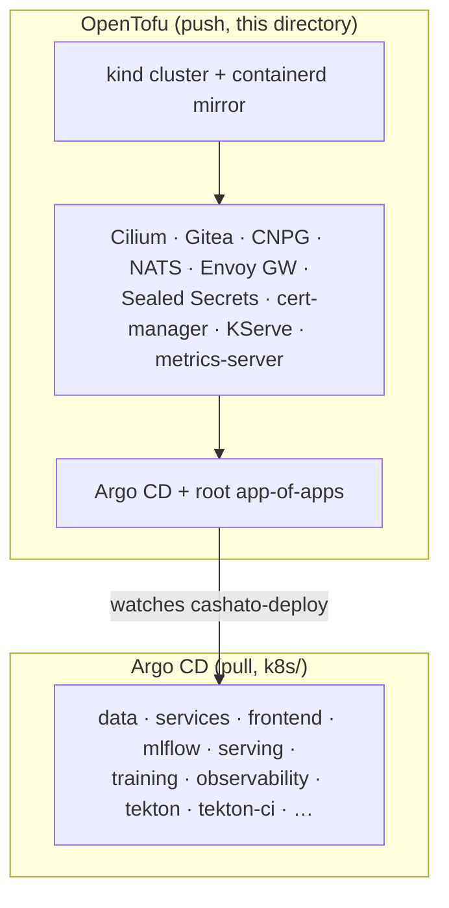

# infra/ — platform provisioning (OpenTofu)

Day-0 provisioning of the local **kind** cluster and every platform
operator/Helm chart. This layer is **state-backed** and applied with a
`tofu apply` (push). Application manifests are **not** here — they live in
`k8s/` (Kustomize) and are delivered by **Argo CD** in GitOps pull.
That boundary is deliberate: OpenTofu owns the platform, Argo CD owns the apps.



The **only** hand-off point is the root app-of-apps: OpenTofu seeds it once,
then everything below it is git-driven.

## Layout

Support files (no layer ordering):

| File            | Purpose                                            |
|-----------------|----------------------------------------------------|
| `versions.tf`   | `terraform{}` block + pinned `required_providers`  |
| `providers.tf`  | `helm` / `kubernetes` providers wired to the cluster |
| `variables.tf`  | inputs meant to be overridden: cluster name, k8s version, and the four `git_*` (bridge user/password, source and deploy repo names) |
| `locals.tf`     | `chart_versions` — single source of truth for chart pins |
| `outputs.tf`    | cluster name, kubeconfig path, API endpoint        |
| `modules/`      | ten modules, one per layer 02–11                   |
| `secret.auto.tfvars` · `secrets/` | secret zero, **gitignored** — generated by `scripts/secret-zero.sh`, see the bootstrap below |

Layer files (numeric prefix = build order; Tofu still resolves the real DAG):

| File                    | Component                          |
|-------------------------|------------------------------------|
| `01-cluster.tf`         | kind cluster (default CNI off)     |
| `02-cilium.tf`          | Cilium CNI + Hubble                |
| `03-gitea.tf`           | Gitea (git + OCI registry)         |
| `04-argocd.tf`          | Argo CD + app-of-apps root         |
| `05-cnpg.tf`            | CloudNativePG operator             |
| `06-nats.tf`            | NATS JetStream                     |
| `07-envoy-gateway.tf`   | Envoy Gateway (Gateway API)        |
| `08-sealed-secrets.tf`  | Sealed Secrets controller          |
| `09-cert-manager.tf`    | cert-manager (KServe dependency)   |
| `10-kserve.tf`          | KServe (model serving)             |
| `11-metrics-server.tf`  | metrics-server (HPA, kubectl top)  |

Layers 02–11 are each a thin call to a module under `modules/<component>/`, so
the root directory reads as a table of contents of the whole platform.
`01-cluster.tf` is the exception and is inline: it declares the `kind_cluster`
resource itself, with the port mappings and the containerd registry-mirror patch
that has nowhere else to live.

## Prerequisites

- Docker daemon running.
- OpenTofu >= 1.9, and a reachable Docker socket. Tofu itself needs no `kind`
  CLI — the provider builds the cluster through the kind *library*.
- The `kind` CLI, `kubectl` and `kubeseal`, for the bootstrap steps after
  `tofu apply` (loading images into the nodes, and re-sealing the secrets).

## Bootstrap from a fresh clone

Six steps, in this order. `tofu apply` is only the second one, and reaching for
it first is the mistake worth warning about — it fails twice over on a fresh
clone. `08-sealed-secrets.tf` reads the pinned keypair with
`file("${path.module}/secrets/sealed-secrets.crt")`, which does not exist yet;
and `git_bridge_password` is the single variable with **no default**, supplied
out-of-band from the gitignored `secret.auto.tfvars`, so Tofu also prompts for a
password nothing has told you to generate. Step 1 produces both.

```sh
# 1. Secret zero: the pinned sealing keypair, the DB role passwords, the MinIO
#    credentials and secret.auto.tfvars. Idempotent — it only creates what is
#    missing, so re-running can never invalidate already-committed SealedSecrets.
#    Back up infra/secrets/ out-of-band: git + that directory is the whole
#    reproducibility story.
./scripts/secret-zero.sh

# 2. The cluster and the platform: kind + Cilium + CNPG + NATS + Envoy Gateway,
#    Sealed Secrets holding the key from step 1, Gitea, and Argo CD with its
#    root app-of-apps.
cd infra && tofu init && tofu apply && cd ..

# 3. Re-seal — MANDATORY on a fork, skip it if you restored infra/secrets/ from
#    backup. The committed SealedSecrets are encrypted to whichever key sealed
#    them, so a new keypair from step 1 leaves them undecryptable by your
#    controller; with the original key they already work, and re-sealing would
#    only churn git (kubeseal uses a fresh session key every run, so the
#    ciphertext changes even when the plaintext does not). Offline against the
#    cert file, no cluster needed. Commit the result — step 6 pushes it, and
#    Argo cannot apply what it cannot see.
#    INCOMPLETE, KNOWINGLY: it rewrites 13 of the 18 committed SealedSecrets.
#    See the gap noted below before you rely on CI or on DB backups.
./scripts/seal-secrets.sh

# 4. Images. The overlays reference registry-less `cashato/*:dev` tags; this
#    builds them and loads them straight into the nodes, so no registry is
#    involved. (Once CI runs, it overwrites those tags with registry-qualified
#    SHAs — see k8s/manifests/tekton-ci/.)
#    EXPECT IT TO ABORT on a fresh clone, at the 5th of 6 images:
#    Dockerfile.train bakes `models/latest.joblib`, which is gitignored and
#    therefore absent, and the script is `set -e`. The four the platform needs
#    (svc, migrate, frontend, mlflow) are built before it, so the abort is
#    cosmetic — only `train`/`predict`, the ML-serving pair, are missing, and
#    they are useless without a trained model anyway. Train one (README, "ML
#    pipeline") and re-run to get them.
./scripts/build-images.sh

# 5. The two Gitea repos. `cashato` is the source Argo reads manifests from;
#    `cashato-deploy` holds the app-of-apps copy Argo watches, seeded from
#    k8s/apps/. Needs the port-forward.
#    CAREFUL later on: re-running this on a live cluster re-seeds
#    cashato-deploy, which RESETS the image tags CI had pinned back to the :dev
#    seed. Harmless at bootstrap, a silent rollback afterwards (the next build
#    re-pins them).
kubectl -n gitea port-forward svc/gitea-http 3000:3000 &
./scripts/gitea-repos.sh

# 6. Push your source into your own Gitea. This is the step that makes a fork
#    self-contained: Argo reads k8s/manifests/ from HERE. Git will prompt —
#    the user is `cashato` and the password is git_bridge_password from
#    infra/secret.auto.tfvars. (Leave it out of the URL so it stays out of
#    .git/config.)
git remote add local http://localhost:3000/cashato/cashato.git
git push local main
```

Then watch it converge: `kubectl -n argocd get applications`.

Expect it to look broken in between. Step 2 creates the root Application
pointing at a `cashato-deploy` that step 5 has not created yet, so Argo reports
an unreachable repository until then, and the children cannot resolve their
manifests until step 6 pushes them. Both clear on their own — Argo retries.
Pods that come up before step 4 sit in `ImagePullBackOff` for the same reason,
and recover once the `:dev` tags are loaded.

### Known gap: four SealedSecrets no script regenerates

`seal-secrets.sh` rewrites 14 of the 18 committed `SealedSecret`s. The other
four are all the CI's, so on a fork they stay encrypted to the upstream key and
fail with a decryption error no sealing key can fix:

| Not regenerated | Breaks |
|---|---|
| `k8s/manifests/tekton-ci/base/sealedsecret-dockerconfig.yaml` | pushing built images |
| `…/sealedsecret-git-basic-auth.yaml` | the CI's git clone/push |
| `…/sealedsecret-gitea-admin.yaml` | the webhook-creation Job |
| `…/sealedsecret-webhook-secret.yaml` | the HMAC check on the webhook |

So a fork gets a working *application* and working *backups*, but a dead *CI
loop* until those four are re-sealed by hand with `kubeseal`. Nothing tracked
generates `infra/secrets/webhook-secret.env` either, which is the other half of
the same gap. It is a real dent in the rule `scripts/README.md` states for
itself — "git + `infra/secrets/` must be enough to rebuild everything" — and it
is recorded rather than glossed because the remedy touches live CI credentials
and deserves its own pass.

### Why the Applications point at an in-cluster address

`apps/*.yaml` carry `repoURL: http://gitea-http.gitea.svc:3000/cashato/cashato.git`,
which is **relative to the cluster**, not to any person: it resolves to
whichever Gitea is running alongside it. That is what makes the sequence above
work unchanged for anyone who forks — their Argo reads their Gitea, and nothing
depends on GitHub or on the upstream repo being reachable.

A public GitHub URL would be the opposite: absolute and personal, pointing at
the upstream forever unless every forker remembered to edit it — and a cluster
that silently deploys someone else's manifests while looking perfectly healthy
is the worst kind of wrong default. If you *do* want Argo pointed elsewhere,
[`k8s/README.md`](../k8s/README.md) covers that and the no-Argo path too.

State (`*.tfstate`) and `.terraform/` are gitignored; `.terraform.lock.hcl` is
committed to pin provider hashes.

## Verify

```sh
kubectl --context kind-cashato get nodes            # nodes Ready
kubectl -n kube-system get pods -l k8s-app=cilium   # cilium pods Running
kubectl -n kube-system get pods | grep hubble       # hubble relay/ui up
```
