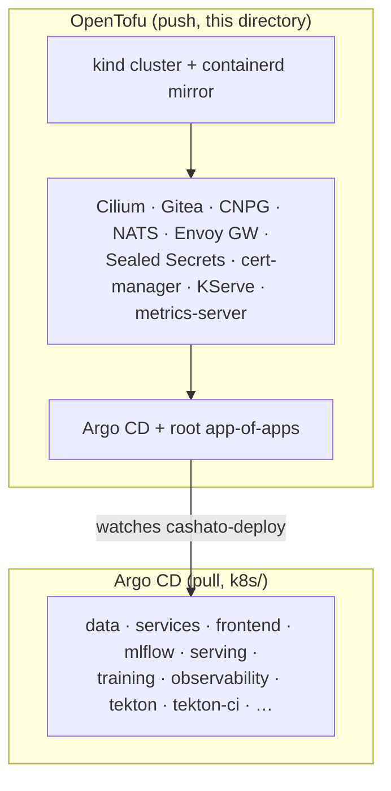

# infra/ — platform provisioning (OpenTofu)

Day-0 provisioning of the local **kind** cluster and every platform
operator/Helm chart. This layer is **state-backed** and applied with a
`tofu apply` (push). Application manifests are **not** here — they live in
`k8s/` (Kustomize) and are delivered by **Argo CD** in GitOps pull.
That boundary is deliberate: OpenTofu owns the platform, Argo CD owns the apps.



The **only** hand-off point is the root app-of-apps: OpenTofu seeds it once,
then everything below it is git-driven.

## Layout

Support files (no layer ordering):

| File            | Purpose                                            |
|-----------------|----------------------------------------------------|
| `versions.tf`   | `terraform{}` block + pinned `required_providers`  |
| `providers.tf`  | `helm` / `kubernetes` providers wired to the cluster |
| `variables.tf`  | inputs meant to be overridden (cluster name, k8s version) |
| `locals.tf`     | `chart_versions` — single source of truth for chart pins |
| `outputs.tf`    | cluster name, kubeconfig path, API endpoint        |

Layer files (numeric prefix = build order; Tofu still resolves the real DAG):

| File                    | Component                          |
|-------------------------|------------------------------------|
| `01-cluster.tf`         | kind cluster (default CNI off)     |
| `02-cilium.tf`          | Cilium CNI + Hubble                |
| `03-gitea.tf`           | Gitea (git + OCI registry)         |
| `04-argocd.tf`          | Argo CD + app-of-apps root         |
| `05-cnpg.tf`            | CloudNativePG operator             |
| `06-nats.tf`            | NATS JetStream                     |
| `07-envoy-gateway.tf`   | Envoy Gateway (Gateway API)        |
| `08-sealed-secrets.tf`  | Sealed Secrets controller          |
| `09-cert-manager.tf`    | cert-manager (KServe dependency)   |
| `10-kserve.tf`          | KServe (model serving)             |
| `11-metrics-server.tf`  | metrics-server (HPA, kubectl top)  |

Each layer file is a thin call to a module under `modules/<component>/`, so the
root directory reads as a table of contents of the whole platform.

## Prerequisites

- Docker daemon running.
- OpenTofu >= 1.9, and a reachable Docker socket (the kind provider builds the
  cluster via the kind library — no `kind` CLI needed).

## Usage

```sh
cd infra
tofu init      # download providers
tofu plan      # review
tofu apply     # create the cluster + platform
```

State (`*.tfstate`) and `.terraform/` are gitignored; `.terraform.lock.hcl` is
committed to pin provider hashes.

## Verify

```sh
kubectl --context kind-cashato get nodes            # nodes Ready
kubectl -n kube-system get pods -l k8s-app=cilium   # cilium pods Running
kubectl -n kube-system get pods | grep hubble       # hubble relay/ui up
```
