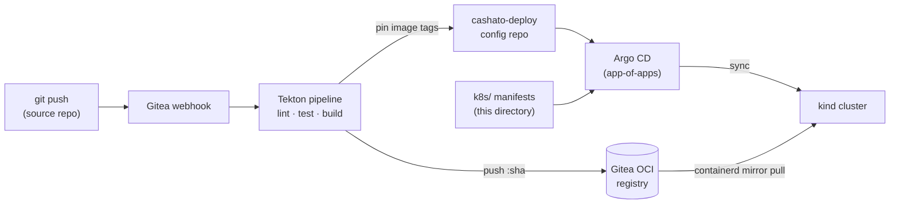

# k8s/ — application desired state (GitOps, Argo CD)

Day-2 application manifests, **delivered by Argo CD in pull** from the git repo.
This is the counterpart to `infra/`: OpenTofu owns the **platform** (cluster +
operators + Argo CD itself), Argo CD owns the **apps** defined here.



The source repo stays **human-only**: CI never commits here. Image tags are
pinned in the separate `cashato-deploy` repo, which Argo watches (details:
[`manifests/tekton-ci/`](manifests/tekton-ci/README.md)).

## Layout

```
k8s/
├─ apps/          # one Argo CD Application per component (app-of-apps children)
└─ manifests/     # the actual Kustomize per component: <x>/{base, overlays/kind}
```

- **Root app-of-apps** is seeded by OpenTofu (`infra/`, argocd-apps chart) and
  watches `apps/` in the `cashato-deploy` repo (seeded from this directory —
  see `scripts/gitea-repos.sh`). It is intentionally not a file here — it is
  the single bootstrap link into GitOps.
- **`apps/`** — each file is an Argo `Application` pointing at
  `manifests/<component>/overlays/kind`. Ordering between components is set with
  the `argocd.argoproj.io/sync-wave` annotation, not filename order.
- **`manifests/`** — one directory per component, each a Kustomize `base` plus an
  `overlays/kind` overlay. (Named `manifests/`, not `components/`, to avoid
  clashing with the Kustomize "Components" feature.)

## Components & sync order

| Component         | wave | Contents |
|-------------------|:----:|----------|
| `cilium-lb`       | −1   | Cilium LB IP pool + L2 announcement policy |
| `data`            | 0    | CNPG `Cluster`, managed roles, Alembic migration Job, grants Job |
| `gateway`         | 1    | Envoy Gateway `Gateway` (the services attach their HTTPRoutes) |
| `minio`           | 1    | S3 backend for MLflow artifacts and the LGTM stores |
| `services`        | 2    | ingest-api, etl-worker, query-api, categorizer + HTTPRoutes + config |
| `frontend`        | 2    | the SPA (nginx) + HTTPRoute for `/` |
| `mlflow`          | 2    | model registry + tracking server |
| `networkpolicies` | 3    | Cilium `NetworkPolicy` (DB reachable only by the services that need it) |
| `training`        | 3    | train CronJob (suspended) + register-champion Job |
| `serving`         | 4    | KServe `InferenceService` (the categorizer's model) |
| `observability`   | 5    | LGTM: Loki, Grafana, Tempo, Mimir + Alloy collector |
| `tekton`          | 6    | Tekton operator config (pipelines + triggers) |
| `tekton-ci`       | 7    | the CI pipeline, triggers, EventListener, webhook Job |

The data layer (wave 0) — Cluster + migrations — completes before the services
(wave 2) start: the "migrate-then-deploy" barrier. DB Jobs are tracked
resources with `Replace=true`, not Sync hooks, so a new migrate image produces
visible drift and actually re-runs.
