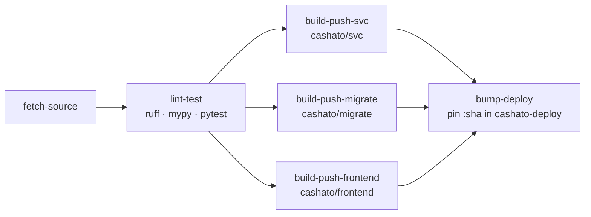

# Tekton CI/CD (`cashato-ci`)

Continuous integration **and delivery** for the cashato monorepo. On every push to
`main` a Gitea webhook hits an in-cluster Tekton EventListener, which starts a
pipeline that lints/type-checks/tests, builds+pushes the three container images to
Gitea's built-in OCI registry (tagged by commit SHA), then **pins those tags in the
`cashato-deploy` config repo** so Argo CD deploys the fresh build automatically.
Delivered as GitOps (Argo app `tekton-ci`, sync-wave 7); the pipeline/trigger
definitions live here, a run is a separate object (webhook-created, or on-demand).

## Pipeline DAG



| Task | What it does | Source |
|------|--------------|--------|
| `fetch-source` | shallow clone of the repo (private → `basic-auth` workspace) | hub: `git-clone` 0.9 |
| `lint-test` | `pip install .[svc,dev]` → `ruff check .` → `mypy src` → `pytest` (mirrors the [Makefile](../../../Makefile) targets) | local Task `cashato-lint-test` |
| `build-push-svc` | build+push `cashato/svc` | hub: `buildah` 0.9 |
| `build-push-migrate` | build+push `cashato/migrate` | hub: `buildah` 0.9 |
| `build-push-frontend` | build+push `cashato/frontend` (node → nginx multi-stage) | hub: `buildah` 0.9 |
| `bump-deploy` | pin `services`/`data`/`frontend` app image tags → `<sha>` in `cashato-deploy`, commit+push | local Task `cashato-bump-deploy` |

The three builds run **in parallel** once `lint-test` passes; `bump-deploy` runs
after all of them, so a lint/test failure blocks all publishing and any lone
build failure blocks the deploy.

## Build-on-push — Triggers + Gitea webhook

An **EventListener** (`el-cashato-ci.cashato-ci.svc:8080`) receives the webhook.
Interceptors: `github` (HMAC-SHA256 via `X-Hub-Signature-256` — Gitea sends
GitHub-compatible headers — + push filter) then `cel` (branch == `main` **and** a
changed file under `src/**`, `frontend/**`, `docker/**`, or `pyproject.toml`/
`alembic.ini`). So docs/k8s/infra/config-only pushes don't rebuild (pushes with
more than 50 commits build unconditionally — Gitea truncates the payload the
filter reads). Both sender (Gitea) and sink live in the cluster →
no public exposure. The webhook is created by an Argo Sync-hook Job (`webhook-job.yaml`).

## Auto-deploy — the `cashato-deploy` config repo

`bump-deploy` writes to a **separate** `cashato-deploy` repo (Argo watches it), never
to the source repo — so the source history stays human-only. It sets
`spec.source.kustomize.images` on the `services`, `data` and `frontend` Argo
Applications to the registry-qualified SHA refs:

```
gitea-http.gitea.svc:3000/cashato/svc:<commit-sha>
gitea-http.gitea.svc:3000/cashato/migrate:<commit-sha>
gitea-http.gitea.svc:3000/cashato/frontend:<commit-sha>
```

That ref is what the nodes' containerd mirror resolves for pulls, so a pushed
image is immediately deployable. Registry is plain-HTTP (`TLSVERIFY=false`); buildah
uses `STORAGE_DRIVER=vfs` to build unprivileged on kind. `cashato-deploy` has no
webhook and the source `k8s/apps/` change doesn't match the path-filter → no loop.
`k8s/apps/` stays in the source repo as the canonical seed (see `scripts/gitea-repos.sh`).

## Which services depend on each built image

The CI builds **3 images** backing **7 workloads** across 2 namespaces:

| Built image | Dockerfile | Consumed by | Namespace |
|-------------|-----------|-------------|-----------|
| **`cashato/svc`** | `docker/Dockerfile.svc` | `ingest-api`, `etl-worker`, `query-api`, `categorizer` (Deployments) | `cashato` |
| **`cashato/migrate`** | `docker/Dockerfile.migrate` | `migration-job`, `grant-job` (Jobs) | `cashato-data` |
| **`cashato/frontend`** | `docker/Dockerfile.frontend` | `frontend` (Deployment, nginx) | `cashato` |

> Out of CI scope (built manually via `scripts/build-images.sh`): the heavy
> `cashato/train`, `cashato/predict`, `cashato/mlflow` images (torch/ST — too slow for
> buildah-on-kind); they stay `:dev`. Can be added as further `build-push-*` tasks later.

## Running a build

Normally automatic (push to `main`). To rebuild HEAD by hand, redeliver the
last push from Gitea (repo → Settings → Webhooks → recent deliveries → Redeliver):
it replays the exact payload through the same interceptors.

```sh
kubectl -n cashato-ci get pipelinerun -w   # or the Tekton Dashboard
```

The `TektonConfig` pruner keeps the last 5 runs (`tektonconfig.yaml`: `keep: 5`,
daily at 13:30).

## Files

| File | Purpose |
|------|---------|
| `base/namespace.yaml` | `cashato-ci` namespace |
| `base/serviceaccount.yaml` | pipeline run identity (auth via workspaces) |
| `base/triggers-rbac.yaml` | EventListener SA + RBAC (create PipelineRuns) |
| `base/sealedsecret-git-basic-auth.yaml` | git clone/push creds (`.gitconfig` + `.git-credentials`) |
| `base/sealedsecret-dockerconfig.yaml` | buildah push creds (`config.json`) |
| `base/sealedsecret-webhook-secret.yaml` | HMAC secret for the github interceptor |
| `base/sealedsecret-gitea-admin.yaml` | Gitea admin creds for the webhook Job |
| `base/task-lint-test.yaml` | the ruff/mypy/pytest Task |
| `base/task-bump-deploy.yaml` | the config-repo image-tag pin Task |
| `base/pipeline.yaml` | the `cashato-ci` Pipeline (DAG above) |
| `base/triggerbinding.yaml` · `triggertemplate.yaml` · `eventlistener.yaml` | Tekton Triggers (build-on-push) |
| `base/webhook-job.yaml` | Argo Sync-hook that ensures the Gitea webhook |
| `overlays/kind/` | environment overlay |
